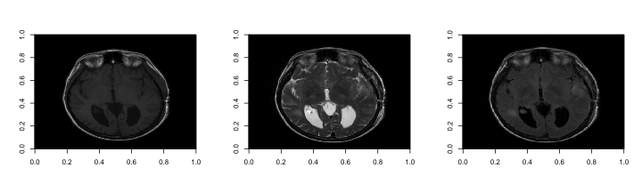
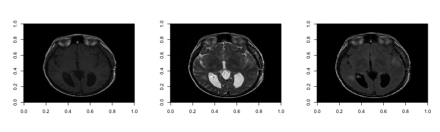
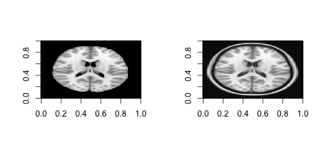
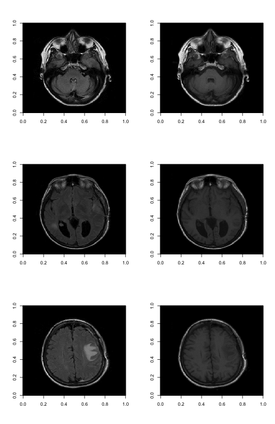
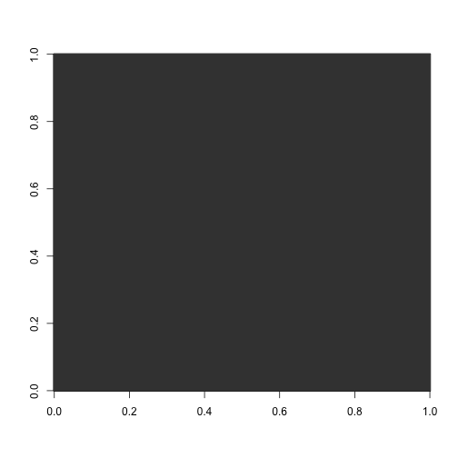
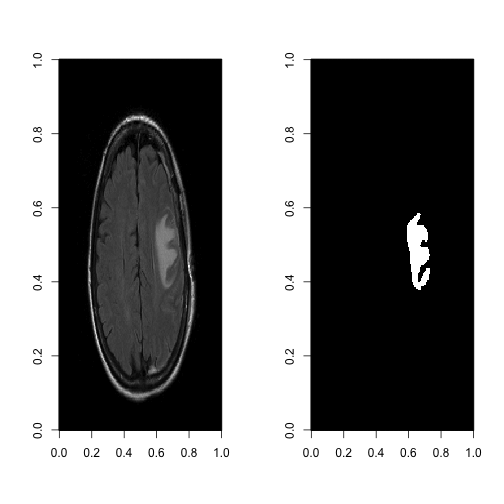
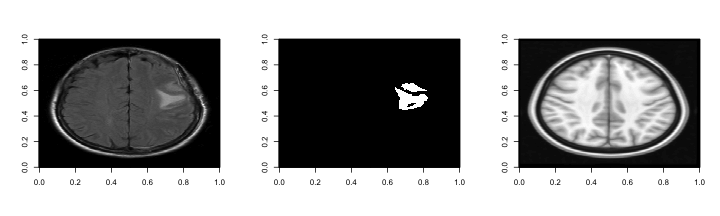

Install the ANTsR and ENARSC2015 R packages off of github using the library devtools.  Note that the ANTsR package may take a substantial amount of time to download. 


```r
library(devtools)
install_github('stnava/ANTsR')
install_github('muschellij2/ENARSC2015')
```

Load the ANTsR and ENARSC2015 libraries. 


```r
library(ANTsR)
```

```
## Loading required package: Rcpp
## Loading required package: signal
## 
## Attaching package: 'signal'
## 
## The following objects are masked from 'package:stats':
## 
##     filter, poly
## 
## Loading required package: timeSeries
## Loading required package: timeDate
## Loading required package: mFilter
```

```
## 
##     'mFilter' version: 0.1-3
## 
##     'mFilter' is a package for time series filtering
## 
##     See 'library(help="mFilter")' for details
## 
##     Author: Mehmet Balcilar, mbalcilar@yahoo.com
```

```
## Loading required package: MASS
## Loading required package: robust
## Loading required package: fit.models
## Loading required package: lattice
## Loading required package: robustbase
## Loading required package: rrcov
## Scalable Robust Estimators with High Breakdown Point (version 1.3-8)
## 
## Loading required package: magic
## Loading required package: abind
## Loading required package: pixmap
## Loading required package: misc3d
## Loading required package: fastICA
## Welcome to ANTsR
```

```r
library(ENARSC2015)
```

```
## Loading required package: oro.nifti
## 
## oro.nifti: Rigorous - NIfTI+ANALYZE+AFNI Input / Output (version = 0.4.0)
## 
## Loading required package: oro.dicom
## 
## oro.dicom: Rigorous - DICOM Input / Output (version = 0.4.1)
## 
## Loading required package: fslr
## Loading required package: stringr
## Loading required package: matrixStats
## matrixStats v0.12.2 (2014-12-07) successfully loaded. See ?matrixStats for help.
## 
## Attaching package: 'matrixStats'
## 
## The following objects are masked from 'package:timeSeries':
## 
##     colCummaxs, colCummins, colCumprods, colCumsums, colMaxs,
##     colMins, colProds, colQuantiles, colSds, colVars, rowCumsums
```

Load volumes
---

The output directory for the analysis (you should change this for your machine).


```r
rootdir = "~/ENARSC2015"
rootdir = Sys.readlink(rootdir)
outdir <- file.path(rootdir, 'inst', 'ANTsR')
stopifnot(file.exists(outdir))
```

For this analysis, we provide the BRAINX data from OsiriX (http://www.osirix-viewer.com/datasets/) in the ENARSC2015 package.  The BRAINX data consists of multi-modal MRI from a patient with brain cancer.  Here we use the T1-w, T2-w and FLAIR volumes. 

Get the path for the T1-w, T2-w, and FLAIR volumes that are contained in the ENARSC2015 package. 


```r
t1.path <- system.file("BRAINIX/NIfTI/T1.nii.gz", package = 'ENARSC2015')
t2.path <- system.file("BRAINIX/NIfTI/T2.nii.gz", package = 'ENARSC2015')
flair.path <- system.file("BRAINIX/NIfTI/FLAIR.nii.gz", package = 'ENARSC2015')
```

Load the T1-w, T2-w, FLAIR as an antsImage.


```r
t1 <- antsImageRead(t1.path, 3)
t2 <- antsImageRead(t2.path, 3)
flair <- antsImageRead(flair.path, 3)
```

Plot volumes
---

View the original T1, T2 and FLAIR volumes.


```r
par(mfrow = c(1,3))
image(as.array(t1)[,,10], col = gray(0:64/64))
image(as.array(t2)[,,10], col = gray(0:64/64))
image(as.array(flair)[,,10], col = gray(0:64/64))
```

 

N3 Correction
---

Create volumes for the N3 corrected T1, T2 and FLAIR volumes.


```r
t1N3 <- antsImageClone(t1)
t2N3 <- antsImageClone(t2)
flairN3 <- antsImageClone(flair)
```

Perform the N3 bias feild correction on the T1, T2 and FLAIR volumes.


```r
N3BiasFieldCorrection(t1@dimension, t1, t1N3, "4")
```

```
## [1] 0
```

```r
N3BiasFieldCorrection(t2@dimension, t2, t2N3, "4")
```

```
## [1] 0
```

```r
N3BiasFieldCorrection(flair@dimension, flair, flairN3, "4")
```

```
## [1] 0
```

Write the N3 corrected files. 


```r
antsImageWrite(t1N3, file.path(outdir, 'T1_ANTsR_N3Correct.nii.gz'))
```

```
## [1] 0
```

```r
antsImageWrite(t2N3, file.path(outdir,'T2_ANTsR_N3Correct.nii.gz'))
```

```
## [1] 0
```

```r
antsImageWrite(flairN3, file.path(outdir,'FLAIR_ANTsR_N3Correct.nii.gz'))
```

```
## [1] 0
```

View the N3 bias feild correction on the T1, T2 and FLAIR volumes.


```r
par(mfrow = c(1,3))
image(as.array(t1N3)[,,10], col = gray(0:64/64))
image(as.array(t2N3)[,,10], col = gray(0:64/64))
image(as.array(flairN3)[,,10], col = gray(0:64/64))
```

 

Templates
---

Read the template with and without skull. 


```r
template.path <- system.file("Template/MNI152_T1_1mm_brain.nii.gz", package = 'ENARSC2015')
template.skull.path <- system.file("Template/MNI152_T1_1mm.nii.gz", package = 'ENARSC2015')
template <- antsImageRead(template.path, 3)
template.skull <- antsImageRead(template.skull.path, 3)
```

Plot the templates. 


```r
par(mfrow = c(1,2))
image(as.array(template)[,,90], col = gray(0:64/64))
image(as.array(template.skull)[,,90], col = gray(0:64/64))
```

 


Registration  
---

First we will register the T1-w volume to the FLAIR volume. 


```r
antsRegOut <- antsRegistration(fixed = flairN3, moving = t1N3 , typeofTransform = "Rigid",  outprefix = "./test")
```

```
## use simple parameterization
```

```r
t1.to.flair <-antsImageClone(antsRegOut$warpedmovout)
```


Write the registered T1-w volume. 


```r
antsImageWrite(t1.to.flair, file.path(outdir, 'T1_ANTsR_N3Correct_regFLAIR.nii.gz'))
```

```
## [1] 0
```

Next we plot the registered FLAIR volume and the T1-w volume to visually assess the quality of the registration. 


```r
par(mfrow = c(3,2))
slices <- c(5, 10, 15)
for(i in slices){
image(as.array(flairN3)[,,i], col = gray(0:64/64))
image(as.array(t1.to.flair)[,,i], col = gray(0:64/64))
}
```

 

Subtract the FLAIR and the T1-w images and plot the result.  


```r
subtraction.image <- antsImageClone(flairN3)
ImageMath( 3 , subtraction.image  , "-", flairN3 , t1.to.flair )
```

```
## [1] 0
```

```r
image(as.array(subtraction.image)[,,10], col = gray(0:64/128))
```

 

Read in a region of interest (ROI).  In this case we have a brain mask of a manual segmentation of a brain tumor. 


```r
roi.path <- system.file("BRAINIX/NIfTI/ROI.nii.gz", package = 'ENARSC2015')
roi <- antsImageRead(roi.path, 3)
```

Display the FLAIR and the ROI  


```r
par(mfrow = c(1,2))
image(as.array(flairN3)[,,15], col = gray(0:64/64))
image(as.array(roi)[,,15], col = gray(0:64/64))
```

 

Perform a non-linear registration of the T1-w image to the MNI template with the skull.  Note that we remove the InverseWarp and Warp files generates by ANTsR, as these files are quite large. 


```r
outprefix = file.path(rootdir, "inst", 'ANTsR', "ants")
antsRegOut.nonlin <- antsRegistration(fixed = template.skull, moving = t1.to.flair, typeofTransform = "SyN",  outprefix = outprefix)
```

```
## use simple parameterization
```


```r
print(antsRegOut.nonlin)
```

```
## $warpedmovout
## An object of class "antsImage"
## Slot "pixeltype":
## [1] "float"
## 
## Slot "dimension":
## [1] 3
## 
## Slot "pointer":
## <pointer: 0x7f96f374a870>
## 
## 
## $warpedfixout
## An object of class "antsImage"
## Slot "pixeltype":
## [1] "float"
## 
## Slot "dimension":
## [1] 3
## 
## Slot "pointer":
## <pointer: 0x7f96f60bd0d0>
## 
## 
## $fwdtransforms
## [1] "/Users/johnmuschelli/Dropbox/Packages/ENAR_SC_2015//inst/ANTsR/ants1Warp.nii.gz"      
## [2] "/Users/johnmuschelli/Dropbox/Packages/ENAR_SC_2015//inst/ANTsR/ants0GenericAffine.mat"
## 
## $invtransforms
## [1] "/Users/johnmuschelli/Dropbox/Packages/ENAR_SC_2015//inst/ANTsR/ants0GenericAffine.mat" 
## [2] "/Users/johnmuschelli/Dropbox/Packages/ENAR_SC_2015//inst/ANTsR/ants1InverseWarp.nii.gz"
```

Extract the non-linear registration of the T1-w image to the MNI template with the skull.


```r
t1.to.flair.to.template <-antsImageClone(antsRegOut.nonlin$warpedmovout)
```

Apply the registration transformation to the FLAIR and the ROI image. 


```r
flair.to.template <- antsApplyTransforms(fixed=template.skull , moving=flairN3 , transformlist=antsRegOut.nonlin$fwdtransforms , interpolator="Linear")
roi.to.template <-antsApplyTransforms(fixed=template.skull , moving=roi , transformlist=antsRegOut.nonlin$fwdtransforms , interpolator="Linear")
```

Threshold the interpolated ROI image so that it is binary. 


```r
roi.to.template.threshold <-antsImageClone(roi.to.template)
ThresholdImage(3, roi.to.template, roi.to.template.threshold, .5, 1)
```

```
## [1] 0
```

Plot the transformed FLAIR, thresheld ROI and template with skull. 


```r
par(mfrow = c(1,3))
image(as.array(flair.to.template)[,,110], col = gray(0:64/64))
image(as.array(roi.to.template.threshold)[,,110], col = gray(0:64/64))
image(as.array(template.skull)[,,110], col = gray(0:64/64))
```

 

Write the transformed FLAIR, ROI and  thresheld ROI.


```r
antsImageWrite(flair.to.template, file.path(outdir, 'FLAIR_ANTsR_N3Correct_regMNI_SyN.nii.gz'))
```

```
## [1] 0
```

```r
antsImageWrite(roi.to.template , file.path(outdir, 'ROI_regMNI_SyN.nii.gz'))
```

```
## [1] 0
```

```r
antsImageWrite(roi.to.template.threshold, file.path(outdir, 'ROI_threshold_regMNI_SyN.nii.gz'))
```

```
## [1] 0
```


```r
file.remove(paste0(outprefix, "1InverseWarp.nii.gz" ) )
```

```
## [1] TRUE
```

```r
file.remove(paste0(outprefix, "1Warp.nii.gz" ) )
```

```
## [1] TRUE
```
