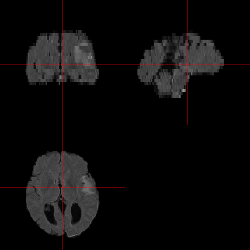
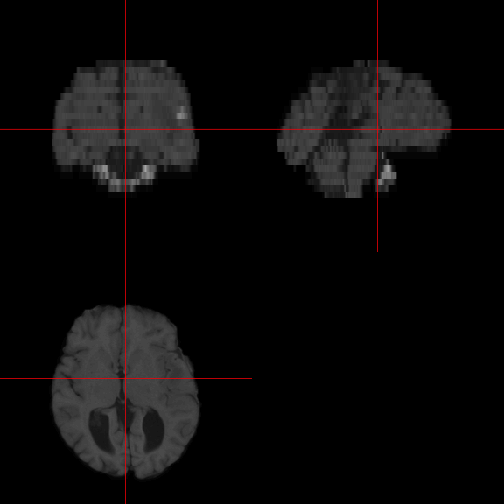
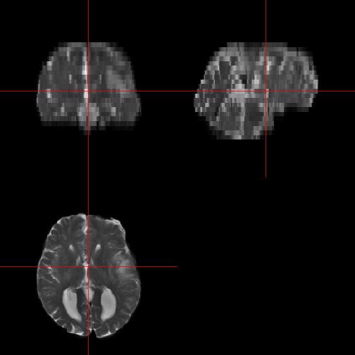
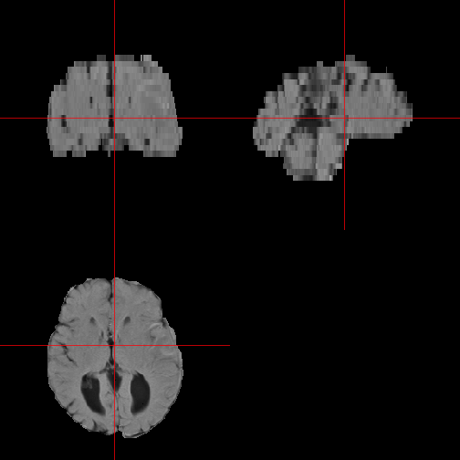
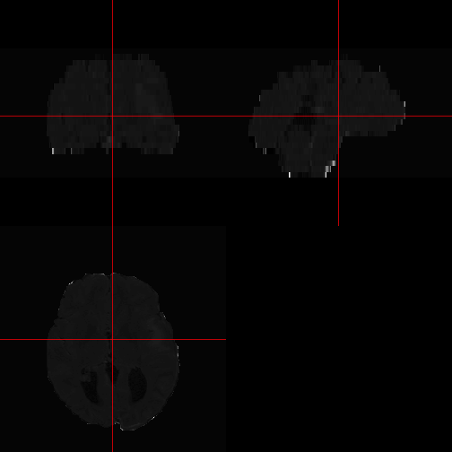
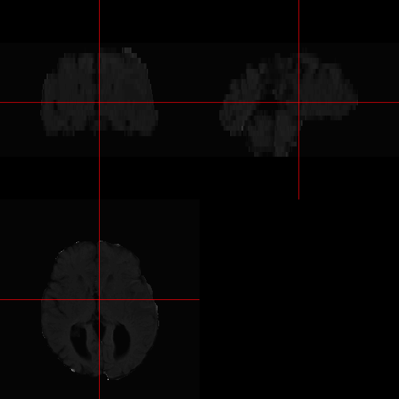
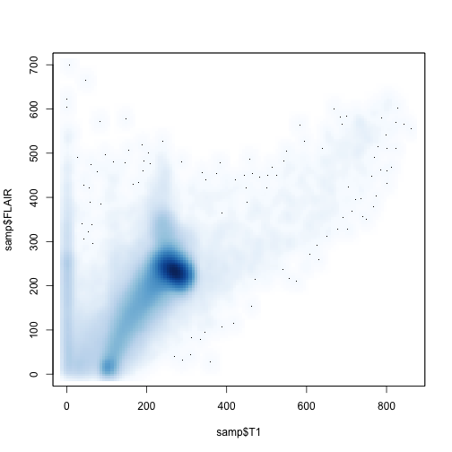
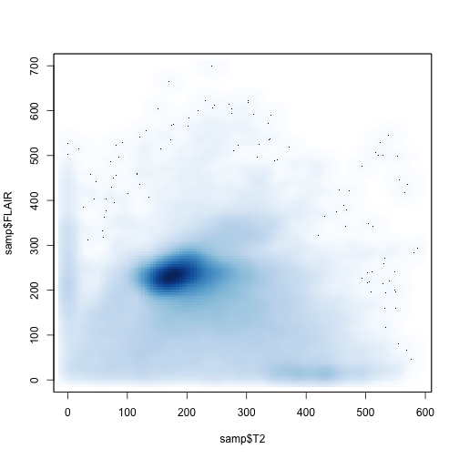
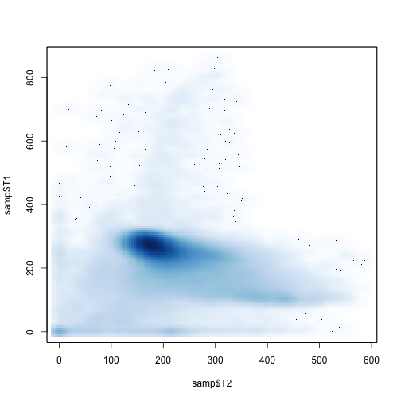

# fslr Processing Pipeline


```r
library(devtools)
install_github("muschellij2/fslr")
```


## Introduction

`fslr` is a package that wraps functions from FSL and `system` calls to integrate input and output from FSL directly into `R`.  Functions in `fslr` tend to have the form `(infile, outfile, retimg)`, where `infile` is an object of class `nifti` or a character string with the filename of the infile, `outfile` is a character string for the output file, and `retimg` is a logical indicating if the output of the function should return an image.

## Step 1: Bias Field Correction
We will use the `fslr` package to do common image manipulations, such as inhomogeneity (bias-field) correction.  If running `R` in a shell environment (e.g. `bash`, `sh`) or within the terminal where system environment variables are "seen" by `R`, there is no need to specify `fsl.path` in options.  Otherwise, `fsl.path` should be the path to FSL.  

Inhomogeneity correction tries to account for any biases in the field induced by the coils in an MRI machine, patient-level factors, machine manufacturer, as well as other factor that contribute to image inhomogeneity.  This step affects all steps downstream in the pipeline.


```r
library(fslr)
library(ENARSC2015)
# outdir = "~/Desktop/results"
rootdir = '~/ENARSC2015'
rootdir = Sys.readlink(rootdir)
outdir = file.path(rootdir, "inst", "FSL")
outdir = path.expand(outdir)
stopifnot(file.exists(outdir))

# if (!file.exists(outdir)){
#   dir.create(outdir, showWarnings =  FALSE)
# }

## If you are running interactively, you need to specify fsl.path
options(fsl.path="/usr/local/fsl")

# copy_data(outdir, get_mipav = FALSE)
mods = c("T1", "T2", "FLAIR")
niis = paste0(mods, ".nii.gz")

files = system.file(file.path("NIfTI", niis), package="ENARSC2015")
roifile = system.file(file.path("NIfTI", "ROI.nii.gz"), package="ENARSC2015")

file.copy(roifile, outdir)
```

```
[1] TRUE
```

```r
outroifile = file.path(outdir, "ROI")
# files = file.path(outdir, "NIfTI", niis)
# roifile = file.path(outdir, "NIfTI", "ROI.nii.gz")

#### remove .nii.gz extension and use basename
stub = nii.stub(files, bn=TRUE)

bias_files = file.path(outdir, paste0(mods, "_FSL_N3Correct"))
names(bias_files) = names(files) = mods
files
```

```
                                                                                            T1 
   "/Library/Frameworks/R.framework/Versions/3.1/Resources/library/ENARSC2015/NIfTI/T1.nii.gz" 
                                                                                            T2 
   "/Library/Frameworks/R.framework/Versions/3.1/Resources/library/ENARSC2015/NIfTI/T2.nii.gz" 
                                                                                         FLAIR 
"/Library/Frameworks/R.framework/Versions/3.1/Resources/library/ENARSC2015/NIfTI/FLAIR.nii.gz" 
```

```r
bias_files
```

```
                                                                                T1 
   "/Users/johnmuschelli/Dropbox/Packages/ENAR_SC_2015//inst/FSL/T1_FSL_N3Correct" 
                                                                                T2 
   "/Users/johnmuschelli/Dropbox/Packages/ENAR_SC_2015//inst/FSL/T2_FSL_N3Correct" 
                                                                             FLAIR 
"/Users/johnmuschelli/Dropbox/Packages/ENAR_SC_2015//inst/FSL/FLAIR_FSL_N3Correct" 
```

Now that we have the files organized, we can run FAST from FSL to do bias-field inhomogeneity correction:

```r
for (ifile in seq_along(files)){
  bias_file = bias_files[ifile]
  file = files[ifile]
  ext = get.imgext()
  bfile = paste0(bias_file, ext)
  if (!file.exists(bfile)){
    fast(file, opts = "-B --nopve -v", outfile=bias_file)
  
    ### remove extra files from fast
    seg_file = paste0(bias_file, "_seg", ext)
    file.remove(seg_file)

    output = paste0(bias_file, "_restore", ext)
    file.rename(output, paste0(bias_file, ".nii.gz"))
  }
}
```

In FAST, it automatically tries to segment (`_seg` file) the image, which is not of interest here and attaches a `_restore` suffix to the file.  Therefore we deleted the segment file and renamed the restore file to the output filename located in `bias_file`. 

## Step 2: Skull Stripping
FSL's brain extraction tool (BET) is used for extracting brain tissue from images, stripping off the skull.


```r
bet_files = paste0(bias_files, "_BET")
names(bet_files) = mods
ext = get.imgext()
bfiles = paste0(bet_files, ext)
if (!all(file.exists(bfiles))){
  fslbet(infile = bias_files["FLAIR"], outfile = bet_files["FLAIR"], 
         opts = "-v", reorient=TRUE)
  fslbet(infile = bias_files["T1"], outfile = bet_files["T1"], 
         opts = "-v", reorient=TRUE)
  fslbet(infile = bias_files["T2"], outfile = bet_files["T2"], 
         opts = "-v", reorient=TRUE)
}
```

## Step 3: Co-registration within Person, across modality

Because all the images are from the same individual at the same time point, we do not expect the brain to be drastically different or change.  Also, images are acquired with the same resolution. Therefore, we can do a rigid-body transformation to co-register the images.  Co-registration attempts to overlay images in the same space so that a voxel in image 1 is the same area of the brain as that voxel in image 2.  

We will use FSL's FLIRT (FMRIB's Linear Image Registration Tool) for this task and the `flirt` command from `fslr`.  We will use the FLAIR image as the reference, so that the T1 and T2 will be transformed in the FLAIR space.

The option `-v` allows for verbose output from `FLIRT`, the `dof=6` refers to 6 degress of freedom (rigid-body-registration).  `outfile` and `omat` are the output filename and the output filename for the transformation matrix to map T1 to FLAIR, and `retimg=TRUE` specifies that `regt1` contain an the registered image of class `nifti`. (this make take a few minutes).


```r
reffile = bet_files["FLAIR"]
infile= bet_files['T1']
ofile = paste0(bet_files['T1'], "_regFLAIR")
omat = paste0(ofile, ".mat")
regt1 = flirt(infile = infile, reffile= reffile, dof = 6, 
      outfile = ofile, omat = omat, opts="-v", retimg=FALSE, 
      reorient=TRUE)
```

```
flirt -in "/Users/johnmuschelli/Dropbox/Packages/ENAR_SC_2015//inst/FSL/T1_FSL_N3Correct_BET" -ref "/Users/johnmuschelli/Dropbox/Packages/ENAR_SC_2015//inst/FSL/FLAIR_FSL_N3Correct_BET" -out "/Users/johnmuschelli/Dropbox/Packages/ENAR_SC_2015//inst/FSL/T1_FSL_N3Correct_BET_regFLAIR" -dof 6 -omat "/Users/johnmuschelli/Dropbox/Packages/ENAR_SC_2015//inst/FSL/T1_FSL_N3Correct_BET_regFLAIR.mat" -v 
```

```r
infile= bet_files['T2']
ofile = paste0(bet_files['T2'], "_regFLAIR")
omat = paste0(ofile, ".mat")
regt2 = flirt(infile = infile, reffile= reffile, dof = 6, 
      outfile = ofile, omat = omat, opts="-v", 
      retimg=TRUE, reorient=FALSE)
```

```
flirt -in "/Users/johnmuschelli/Dropbox/Packages/ENAR_SC_2015//inst/FSL/T2_FSL_N3Correct_BET" -ref "/Users/johnmuschelli/Dropbox/Packages/ENAR_SC_2015//inst/FSL/FLAIR_FSL_N3Correct_BET" -out "/Users/johnmuschelli/Dropbox/Packages/ENAR_SC_2015//inst/FSL/T2_FSL_N3Correct_BET_regFLAIR" -dof 6 -omat "/Users/johnmuschelli/Dropbox/Packages/ENAR_SC_2015//inst/FSL/T2_FSL_N3Correct_BET_regFLAIR.mat" -v 
```

## Step 3b: Co-registration within Person, across modality
Depending on how certain pipelines or data, some people co-register images with skull on:


```r
reffile = bias_files["FLAIR"]
infile= bias_files['T1']
ofile = paste0(bias_files['T1'], "_regFLAIR")
omat = paste0(ofile, ".mat")
regt1 = flirt(infile = infile, reffile= reffile, dof = 6, 
      outfile = ofile, omat = omat, opts="-v", retimg=TRUE,
      reorient = FALSE)
```

```
flirt -in "/Users/johnmuschelli/Dropbox/Packages/ENAR_SC_2015//inst/FSL/T1_FSL_N3Correct" -ref "/Users/johnmuschelli/Dropbox/Packages/ENAR_SC_2015//inst/FSL/FLAIR_FSL_N3Correct" -out "/Users/johnmuschelli/Dropbox/Packages/ENAR_SC_2015//inst/FSL/T1_FSL_N3Correct_regFLAIR" -dof 6 -omat "/Users/johnmuschelli/Dropbox/Packages/ENAR_SC_2015//inst/FSL/T1_FSL_N3Correct_regFLAIR.mat" -v 
```

```r
infile= bias_files['T2']
ofile = paste0(bias_files['T2'], "_regFLAIR")
omat = paste0(ofile, ".mat")
regt2 = flirt(infile = infile, reffile= reffile, dof = 6, 
      outfile = ofile, omat = omat, opts="-v", retimg=TRUE, 
      reorient = FALSE)
```

```
flirt -in "/Users/johnmuschelli/Dropbox/Packages/ENAR_SC_2015//inst/FSL/T2_FSL_N3Correct" -ref "/Users/johnmuschelli/Dropbox/Packages/ENAR_SC_2015//inst/FSL/FLAIR_FSL_N3Correct" -out "/Users/johnmuschelli/Dropbox/Packages/ENAR_SC_2015//inst/FSL/T2_FSL_N3Correct_regFLAIR" -dof 6 -omat "/Users/johnmuschelli/Dropbox/Packages/ENAR_SC_2015//inst/FSL/T2_FSL_N3Correct_regFLAIR.mat" -v 
```

## Step 4 Calculations
Now that the images are in the same space, we can do basic calculation between 2 images, such as differences, or ratios. 


```r
bet_files = paste0(bias_files, "_BET")
names(bet_files) = mods
flair = readNIfTI(bet_files['FLAIR'], reorient=FALSE)
roi = readNIfTI(roifile, reorient=FALSE)
mask = flair > 0
regt1 = readNIfTI(paste0(bet_files['T1'], "_regFLAIR"), reorient=FALSE)
regt2 = readNIfTI(paste0(bet_files['T2'], "_regFLAIR"), reorient=FALSE)
orthographic(flair)
```

 

```r
orthographic(regt1)
```

 

```r
orthographic(regt2)
```

 

```r
diff.t1 = flair
diff.t1@.Data = flair - regt1
diff.t1[mask == 0] = min(diff.t1[mask==1])
### to set cal_min and @cal_max for plotting
diff.t1 = cal_img(diff.t1)
orthographic(diff.t1)
```

 

```r
diff.t2 = flair
diff.t2@.Data = flair - regt2
diff.t2[mask == 0] = min(diff.t2[mask==1])
### to set cal_min and @cal_max for plotting
diff.t2 = cal_img(diff.t2)
orthographic(diff.t2)
```

 

```r
rat.t1 = flair
rat.t1@.Data = flair / regt1
rat.t1[mask == 0] = min(rat.t1[mask==1])
rat.t1[is.infinite(rat.t1)]= 0
rat.t1[rat.t1 > 1000]= 1000
rat.t1 = log(rat.t1 + 1)
### to set cal_min and @cal_max for plotting
rat.t1 = cal_img(rat.t1)
orthographic(rat.t1)
```

 

```r
rat.t2 = flair
rat.t2@.Data = flair / regt2
rat.t2[mask == 0] = min(rat.t2[mask==1])
rat.t2[is.infinite(rat.t2)]= 0
rat.t2[rat.t2 > 1000]= 1000
rat.t2 = log(rat.t2 + 1)
### to set cal_min and @cal_max for plotting
rat.t2 = cal_img(rat.t2)
orthographic(rat.t2)
```

 

We can also look at the values of each voxel acorss modalities:


```r
df = data.frame(FLAIR=c(flair), T1= c(regt1), T2 = c(regt2), ROI=c(roi))
df = df[ c(mask) == 1, ]
samp = df[ sample(nrow(df), size=1e5), ]
plot(FLAIR ~ T1, data = samp, pch='.')
```

 

```r
smoothScatter(samp$T1, samp$FLAIR)
```

```
KernSmooth 2.23 loaded
Copyright M. P. Wand 1997-2009
```

 

```r
plot(FLAIR ~ T2, data = samp, pch='.')
```

 

```r
smoothScatter(samp$T2, samp$FLAIR)
```

 

```r
plot(T1 ~ T2, data = samp, pch='.')
```

 

```r
smoothScatter(samp$T2, samp$T1)
```

 


## Step 5 Registration to Template

To register images to a template in FSL, we must first register the image to the template using an affine registration first (http://fsl.fmrib.ox.ac.uk/fsl/fslwiki/FLIRT).  

As we have the ROI in FLAIR space (as it was from the FLAIR), and the co-registered T1 image, we can transform this co-registered T1 to the template (which is T1) and we can use this transform for the FLAIR, T2, and ROI.


```r
atlas = file.path(fsldir(), "data", "standard", "MNI152_T1_1mm.nii.gz")
t1 = paste0(bias_files['T1'], "_regFLAIR")
reg.t1 = paste0(t1, '_regMNI')
omat = paste0(t1, ".mat")
res = flirt(infile = t1, reffile = atlas, 
      omat = omat,
      outfile = reg.t1,
      dof=12, opts= "-v"
      )
```

```
flirt -in "/Users/johnmuschelli/Dropbox/Packages/ENAR_SC_2015//inst/FSL/T1_FSL_N3Correct_regFLAIR" -ref "/usr/local/fsl/data/standard/MNI152_T1_1mm.nii.gz" -out "/Users/johnmuschelli/Dropbox/Packages/ENAR_SC_2015//inst/FSL/T1_FSL_N3Correct_regFLAIR_regMNI" -dof 12 -omat "/Users/johnmuschelli/Dropbox/Packages/ENAR_SC_2015//inst/FSL/T1_FSL_N3Correct_regFLAIR.mat" -v 
```


```r
fnirt.t1 = paste0(t1, '_regMNI_FNIRT')
cimg = paste0(fnirt.t1, "_coeff")

opts = '--verbose'
opts = paste(opts, sprintf(" --cout=%s --subsamp=8,8,4,2", cimg))
res = fnirt(infile = reg.t1, reffile = atlas, 
      outfile = fnirt.t1,
      opts= opts, 
      intern = FALSE
      )
```

```
fnirt --in="/Users/johnmuschelli/Dropbox/Packages/ENAR_SC_2015//inst/FSL/T1_FSL_N3Correct_regFLAIR_regMNI" --ref="/usr/local/fsl/data/standard/MNI152_T1_1mm.nii.gz" --iout="/Users/johnmuschelli/Dropbox/Packages/ENAR_SC_2015//inst/FSL/T1_FSL_N3Correct_regFLAIR_regMNI_FNIRT" --verbose  --cout=/Users/johnmuschelli/Dropbox/Packages/ENAR_SC_2015//inst/FSL/T1_FSL_N3Correct_regFLAIR_regMNI_FNIRT_coeff --subsamp=8,8,4,2 
```


```r
t2 = paste0(bias_files['T2'], "_regFLAIR")
reg.t2 = paste0(t2, '_regMNI')
fnirt.t2 = paste0(t2, '_regMNI_FNIRT')

flirt_apply(infile = t2, 
            reffile = atlas, 
            initmat = omat,
            outfile = reg.t2, 
            opts = "-v")
```

```
flirt -in "/Users/johnmuschelli/Dropbox/Packages/ENAR_SC_2015//inst/FSL/T2_FSL_N3Correct_regFLAIR" -ref "/usr/local/fsl/data/standard/MNI152_T1_1mm.nii.gz" -out "/Users/johnmuschelli/Dropbox/Packages/ENAR_SC_2015//inst/FSL/T2_FSL_N3Correct_regFLAIR_regMNI" -init "/Users/johnmuschelli/Dropbox/Packages/ENAR_SC_2015//inst/FSL/T1_FSL_N3Correct_regFLAIR.mat" -applyxfm -v 
```

```
[1] "The output image will use the sform from the reference image"
[2] "Init Matrix = "                                              
[3] "1.049340 0.051326 -0.003364 -36.528583 "                     
[4] "-0.032867 1.035852 0.267506 -11.418611 "                     
[5] "0.023902 -0.267975 1.159702 30.441737 "                      
[6] "0.000000 0.000000 0.000000 1.000000 "                        
[7] ""                                                            
```

```r
fsl_applywarp(infile = reg.t2, 
                 reffile = atlas, 
                 warpfile = cimg,                  
                 outfile = fnirt.t2,               
                 intern=FALSE,
                 opts= "-v")
```

```
applywarp --in="/Users/johnmuschelli/Dropbox/Packages/ENAR_SC_2015//inst/FSL/T2_FSL_N3Correct_regFLAIR_regMNI" --ref="/usr/local/fsl/data/standard/MNI152_T1_1mm.nii.gz" --out="/Users/johnmuschelli/Dropbox/Packages/ENAR_SC_2015//inst/FSL/T2_FSL_N3Correct_regFLAIR_regMNI_FNIRT" --warp="/Users/johnmuschelli/Dropbox/Packages/ENAR_SC_2015//inst/FSL/T1_FSL_N3Correct_regFLAIR_regMNI_FNIRT_coeff" -v 
```

```
[1] 0
```

```r
flair = bias_files['FLAIR']
reg.flair = paste0(flair, '_regMNI')
fnirt.flair = paste0(flair, '_regMNI_FNIRT')

flirt_apply(infile = flair, 
            reffile = atlas, 
            initmat = omat,
            outfile = reg.flair, 
            opts = "-v")
```

```
flirt -in "/Users/johnmuschelli/Dropbox/Packages/ENAR_SC_2015//inst/FSL/FLAIR_FSL_N3Correct" -ref "/usr/local/fsl/data/standard/MNI152_T1_1mm.nii.gz" -out "/Users/johnmuschelli/Dropbox/Packages/ENAR_SC_2015//inst/FSL/FLAIR_FSL_N3Correct_regMNI" -init "/Users/johnmuschelli/Dropbox/Packages/ENAR_SC_2015//inst/FSL/T1_FSL_N3Correct_regFLAIR.mat" -applyxfm -v 
```

```
[1] "The output image will use the sform from the reference image"
[2] "Init Matrix = "                                              
[3] "1.049340 0.051326 -0.003364 -36.528583 "                     
[4] "-0.032867 1.035852 0.267506 -11.418611 "                     
[5] "0.023902 -0.267975 1.159702 30.441737 "                      
[6] "0.000000 0.000000 0.000000 1.000000 "                        
[7] ""                                                            
```

```r
fsl_applywarp(infile = reg.flair, 
                 reffile = atlas, 
                 warpfile = cimg,                  
                 outfile = fnirt.flair,               
                 intern=FALSE,
                 opts= "-v")
```

```
applywarp --in="/Users/johnmuschelli/Dropbox/Packages/ENAR_SC_2015//inst/FSL/FLAIR_FSL_N3Correct_regMNI" --ref="/usr/local/fsl/data/standard/MNI152_T1_1mm.nii.gz" --out="/Users/johnmuschelli/Dropbox/Packages/ENAR_SC_2015//inst/FSL/FLAIR_FSL_N3Correct_regMNI_FNIRT" --warp="/Users/johnmuschelli/Dropbox/Packages/ENAR_SC_2015//inst/FSL/T1_FSL_N3Correct_regFLAIR_regMNI_FNIRT_coeff" -v 
```

```
[1] 0
```

```r
roi = nii.stub(outroifile)
reg.roi = paste0(roi, '_regMNI')
fnirt.roi = paste0(roi, '_regMNI_FNIRT')

flirt_apply(infile = roi, 
            reffile = atlas, 
            initmat = omat,
            outfile = reg.roi, 
            opts = "-v")
```

```
flirt -in "/Users/johnmuschelli/Dropbox/Packages/ENAR_SC_2015//inst/FSL/ROI" -ref "/usr/local/fsl/data/standard/MNI152_T1_1mm.nii.gz" -out "/Users/johnmuschelli/Dropbox/Packages/ENAR_SC_2015//inst/FSL/ROI_regMNI" -init "/Users/johnmuschelli/Dropbox/Packages/ENAR_SC_2015//inst/FSL/T1_FSL_N3Correct_regFLAIR.mat" -applyxfm -v 
```

```
[1] "The output image will use the sform from the reference image"
[2] "Init Matrix = "                                              
[3] "1.049340 0.051326 -0.003364 -36.528583 "                     
[4] "-0.032867 1.035852 0.267506 -11.418611 "                     
[5] "0.023902 -0.267975 1.159702 30.441737 "                      
[6] "0.000000 0.000000 0.000000 1.000000 "                        
[7] ""                                                            
```

```r
fsl_applywarp(infile = reg.roi, 
                 reffile = atlas, 
                 warpfile = cimg,                  
                 outfile = fnirt.roi,               
                 intern=FALSE,
                 opts= "-v")
```

```
applywarp --in="/Users/johnmuschelli/Dropbox/Packages/ENAR_SC_2015//inst/FSL/ROI_regMNI" --ref="/usr/local/fsl/data/standard/MNI152_T1_1mm.nii.gz" --out="/Users/johnmuschelli/Dropbox/Packages/ENAR_SC_2015//inst/FSL/ROI_regMNI_FNIRT" --warp="/Users/johnmuschelli/Dropbox/Packages/ENAR_SC_2015//inst/FSL/T1_FSL_N3Correct_regFLAIR_regMNI_FNIRT_coeff" -v 
```

```
[1] 0
```

```r
fnirt.troi = paste0(roi, '_threshold_regMNI_FNIRT')

fslthresh(fnirt.roi, outfile = fnirt.troi, thresh = 0.5, opts = "-bin")
```

```
fslmaths "/Users/johnmuschelli/Dropbox/Packages/ENAR_SC_2015//inst/FSL/ROI_regMNI_FNIRT" -thr 0.500000 -bin "/Users/johnmuschelli/Dropbox/Packages/ENAR_SC_2015//inst/FSL/ROI_threshold_regMNI_FNIRT" 
```

```
character(0)
```

```r
# fsl_applywarp()
# cimg
```
